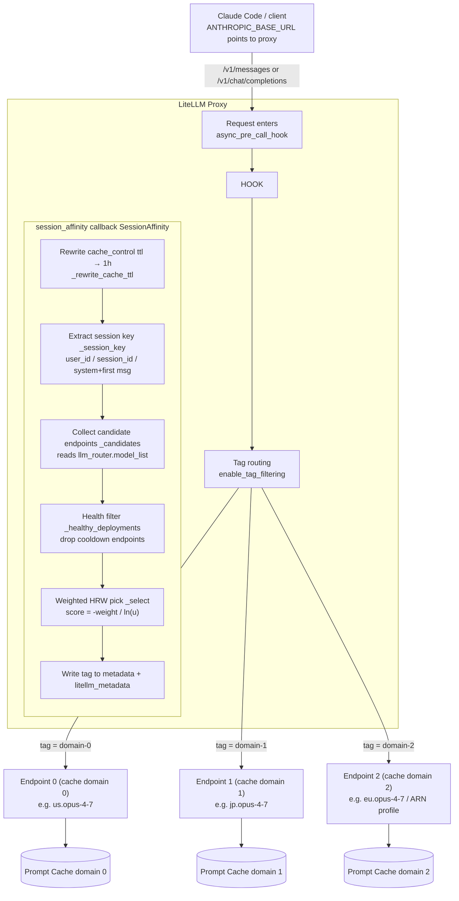
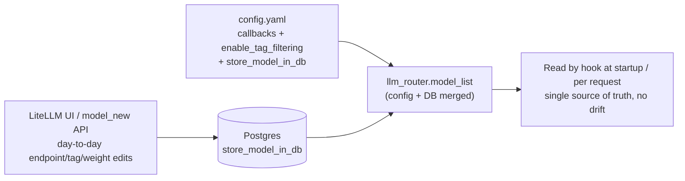

# LiteLLM Session-Affinity Routing for Multi-Cloud Prompt Cache

> Route each conversation to a stable upstream cache domain so prompt cache reads are preserved and cost drops.
> Transparent to both Claude Code users and LiteLLM administrators. End-to-end verified on **litellm 1.90.1**.

[中文](README.md) | English

---

## 1. Background

A single logical model in LiteLLM is often backed by multiple upstream deployments: multiple AWS accounts or regions for Bedrock Claude, multiple cloud providers, multiple projects, multiple API keys, or separate capacity pools.

Most prompt-cache implementations are scoped to an upstream **cache domain**. For Bedrock this is typically `(account, region)`; for other providers it may be `(provider, project, region, credential, deployment)` or a similar boundary.

If a stateless load balancer sends different turns of the same conversation to different cache domains:

- later turns cannot read cache entries written by earlier turns;
- the system repeatedly pays cache **write** cost while missing the cheaper cache **read** path.

LiteLLM's default routing strategies, such as `simple-shuffle`, choose a deployment independently per request. That is great for spreading traffic, but it naturally breaks conversation affinity.

**Core issue:** the cache is not misconfigured; the router is missing session affinity.

---

## 2. Solution Overview

This project provides a LiteLLM `async_pre_call_hook` custom callback. Before a request is sent to the upstream model provider, the hook:

1. extracts a stable session key, preferring `metadata.user_id` / `session_id` and falling back to `system + first messages`;
2. uses weighted Rendezvous / HRW hashing to choose one currently healthy, non-cooldown deployment;
3. writes the chosen deployment tag into the request so LiteLLM's tag router sends it to the exact deployment.

Capabilities:

| Capability | Description |
|---|---|
| Session affinity | The same session lands on the same cache domain / endpoint, so prompt cache reads remain stable. |
| Weighted distribution | Traffic is split by `model_info.hrw_weight`, so larger capacity pools receive more sessions. |
| Health awareness | Deployments in cooldown are excluded; affected sessions move to healthy deployments. |
| Minimal movement | Adding or removing an endpoint only moves sessions that need to move. |
| Multi-cloud support | The hook only depends on LiteLLM deployment tags, so it can be used with Bedrock, Vertex AI, Anthropic, OpenAI-compatible endpoints, and mixed provider groups. |
| Transparent operation | Only `config.yaml` and one callback file are required; individual developers do not need per-user setup. |
| Safe degradation | Internal LiteLLM API calls are wrapped with fallbacks; failures degrade routing instead of blocking requests. |

---

## 2.1 Architecture Diagram

**Request flow** (one Claude Code request → stably lands on the same cache domain):



**Config sources** (where endpoints, tags, and weights come from — the hook always reads `llm_router.model_list` at runtime):



> Key point: the hook is just an `async_pre_call_hook` callback that runs **before** the model call. It does not replace the routing engine; it only tags the request correctly, turning "which cache domain to pick" into a stateful, sticky decision.

---

## 3. Why Weighted HRW Instead of Modulo Hashing

The session key must map to an endpoint with minimal movement when endpoints are added, removed, or temporarily cooled down. Otherwise a single endpoint event can invalidate cache locality for nearly every session.

- **Modulo hashing, `hash % N`**: when `N` changes, almost every key is remapped.
- **HRW / Rendezvous hashing**: compute `score(key, endpoint)` for every endpoint and choose the maximum. Removing one endpoint only moves sessions that were assigned to that endpoint.
- **Weighted HRW** using the Resch formula: `score = -weight / ln(u)`, where `u = hash(key, tag)` normalized to `(0, 1)`. Endpoint `i` is selected with probability `w_i / sum(w)` while preserving minimal movement.

Health awareness composes naturally with weighted HRW: a cooldown deployment disappears from the candidate set, and the same `argmax` logic redistributes affected sessions across the remaining weights.

---

## 4. Deployment

### 4.1 Directory Layout

```text
litellm-affinity/
├── README.md
├── README.en.md
├── pytest.ini
├── real_config.yaml
├── test_config.yaml
├── session_affinity.py -> src/...
├── src/
│   └── session_affinity.py
├── tests/
├── scripts/
└── secrets/
    ├── .secrets.env.template
    └── .secrets.env
```

`config.yaml` and the root-level `session_affinity.py` symlink must live in the same directory. LiteLLM resolves `callbacks: session_affinity.proxy_handler_instance` relative to the config file directory, not through `PYTHONPATH`.

### 4.2 Key `config.yaml` Fragment

Create one deployment per cache domain / upstream endpoint. All deployments in the same routing group share the same `model_name`, and each deployment has a unique tag plus a relative weight.

The example below uses Bedrock, but the same tag and weight rules apply to any LiteLLM-supported provider. For other clouds or OpenAI-compatible endpoints, replace `litellm_params` with the provider-specific fields.

```yaml
model_list:
  - model_name: claude-sonnet
    litellm_params:
      model: bedrock/us.anthropic.claude-...
      aws_region_name: us-east-1
      # Credentials for cache domain A, such as one AWS account/region,
      # GCP project/region, or OpenAI-compatible base_url/api_key.
      tags: ["cache-domain-0"]
    model_info:
      id: dep-a
      hrw_weight: 3
  - model_name: claude-sonnet
    litellm_params:
      model: bedrock/...
      aws_region_name: ...
      tags: ["cache-domain-1"]
    model_info:
      id: dep-b
      hrw_weight: 1

router_settings:
  enable_tag_filtering: true

litellm_settings:
  callbacks: session_affinity.proxy_handler_instance

general_settings:
  master_key: os.environ/LITELLM_MASTER_KEY
```

The single source of truth is `model_list`: endpoint count, tags, and weights all live there. Changing providers, accounts, regions, capacity pools, or weights does not require code changes.

### 4.3 `session_affinity.py`

The callback source lives in `src/session_affinity.py`. The root-level `session_affinity.py` is a symlink so LiteLLM can load it from the config directory.

Core flow:

```text
_session_key -> _candidates -> _select -> write tag
```

### 4.4 Start LiteLLM

With pip:

```bash
pip install 'litellm[proxy]'
cd litellm-affinity/
litellm --config real_config.yaml --port 4000
```

With Docker:

```bash
docker run -p 4000:4000 -v $(pwd):/app -w /app \
  -e LITELLM_MASTER_KEY=sk-... \
  ghcr.io/berriai/litellm:<pinned-tag> --config real_config.yaml
```

Pin the LiteLLM image or package version in production. Do not use `main-latest` without running the upgrade tests described below.

### 4.5 Claude Code Client Setup

Developers only need to point Claude Code at the LiteLLM proxy:

```bash
export ANTHROPIC_BASE_URL=http://<litellm-host>:4000
export ANTHROPIC_AUTH_TOKEN=sk-<litellm-key>
export ANTHROPIC_MODEL=claude-sonnet
export ANTHROPIC_SMALL_FAST_MODEL=claude-haiku
```

### 4.6 LiteLLM UI / DB Hybrid Mode

The Python callback itself cannot be registered through the LiteLLM UI or database. Keep this in `config.yaml`:

```yaml
litellm_settings:
  callbacks: session_affinity.proxy_handler_instance
router_settings:
  enable_tag_filtering: true
general_settings:
  master_key: os.environ/LITELLM_MASTER_KEY
  store_model_in_db: true
```

Then add endpoints through the UI or `/model/new` API:

- **Model Name**: use the same value for every endpoint in the group, for example `claude-sonnet`.
- **Provider / Model / Credentials / Region / Base URL**: set provider-specific upstream details.
- **Advanced Settings -> Tags**: use one unique tag per cache domain, such as `cache-domain-0`.
- **Advanced Settings -> Weight**: set the relative capacity, for example `3`.

Equivalent `/model/new` example:

```bash
curl -X POST http://<host>:4000/model/new \
  -H "Authorization: Bearer $LITELLM_MASTER_KEY" -H "Content-Type: application/json" \
  -d '{
    "model_name": "claude-sonnet",
    "litellm_params": {
      "model": "bedrock/us.anthropic.claude-opus-4-7",
      "aws_region_name": "us-east-1",
      "api_key": "os.environ/AWS_BEARER_TOKEN_BEDROCK",
      "tags": ["cache-domain-0"], "weight": 3
    },
    "model_info": { "hrw_weight": 3 }
  }'
```

Weight lookup order is:

```text
model_info.hrw_weight -> litellm_params.weight -> 1
```

Because tag routing pins a request to one exact deployment, LiteLLM's built-in `weight` field is safe to reuse as the HRW weight source.

---

## 5. Implementation Notes and Pitfalls

These details were found through real LiteLLM proxy testing:

1. **`/v1/messages` and `/v1/chat/completions` read tags from different keys**
   - `/v1/chat/completions` (`acompletion`) reads `metadata["tags"]`.
   - `/v1/messages` reads `litellm_metadata["tags"]`.
   - Claude Code uses `/v1/messages`, so the callback writes both keys.

2. **`_get_healthy_deployments` is an internal LiteLLM API**
   - In 1.90.1 it is called as `_get_healthy_deployments(model, parent_otel_span)` and returns `(healthy, all)`.
   - The callback handles signature and return-shape differences, and falls back to all deployments if health filtering cannot be read.

3. **Explicit tags are respected**
   - If a request already includes `x-litellm-tags` or body tags, the callback does not overwrite them. This keeps manual routing and debugging possible.

---

## 6. Verification Results on LiteLLM 1.90.1

### 6.1 Real Bedrock Prompt Cache Hit

The following test used Bedrock Claude Opus 4.7 profiles in US / JP / EU as three independent cache domains. The same principle applies to multi-cloud setups when the upstream provider supports prompt cache and endpoints have independent cache domains.

| Step | Endpoint | cache_creation | cache_read | Result |
|---|---|---:|---:|---|
| Domain A first call | US | 11057 | 0 | Cache written |
| Domain A repeated call | US | 0 | **11057** | Cache hit |
| Domain B same prompt | JP | 11057 | 0 | Cache miss after changing domain |
| Same session via callback | Same endpoint x2 | 0 | **11057** | Affinity preserves cache reads |

After a cache hit, that prefix costs roughly **1/12** of a write path in this Bedrock test.

### 6.2 Weighted Routing

Real proxy test, weights US:JP:EU = 3:2:1, 600 sessions:

```text
dep-us  303  (50.5% vs 50.0%)
dep-jp  201  (33.5% vs 33.3%)
dep-eu   96  (16.0% vs 16.7%)
```

### 6.3 Endpoint Cooldown Migration

Real cooldown mechanism, 6000 sessions:

- all healthy: 2970 / 2016 / 1014 (3:2:1);
- EU down: only the 1014 EU sessions moved, redistributed US:JP as 3:2;
- US down: JP/EU sessions had zero movement.

The full test suite had **13 passed** at the time of writing.

---

## 7. Tests and Upgrade Process

This project uses an internal LiteLLM router API, so every LiteLLM upgrade must run the tests before rollout.

Run all tests from the repository root:

```bash
pytest
```

Test layers:

| Layer | File | Purpose |
|---|---|---|
| L1 pure logic | `tests/test_logic.py` | Version-independent affinity, weighted distribution, and minimal movement. |
| L2 contract | `tests/test_litellm_contract.py` | Current-version assertions for hook signature, `model_list` shape, health API presence, and both metadata tag keys. |
| L3 behavior | `tests/test_health_filtering.py`, `tests/test_failover_weighted.py` | Real cooldown-driven behavior: health filtering, failover movement, zero disturbance, and weighted redistribution. |

Optional end-to-end scripts:

- `scripts/run_distribution.py` checks weighted distribution against a real proxy.
- `scripts/run_real_test.py` checks real upstream prompt cache behavior. The current example targets Bedrock and requires `secrets/.secrets.env`.

Upgrade runbook:

1. Pin the target LiteLLM version in an isolated environment.
2. Run `pytest`: L1 should pass; if L2 fails, update the internal API adapter; then confirm L3 behavior.
3. Test in staging with real traffic.
4. Canary before full rollout.
5. Keep L1/L2/L3 in CI for future LiteLLM version bumps.

---

## 8. Operations Notes

- **Changing weights**: update `model_info.hrw_weight`. HRW only moves the marginal share required by the new weights.
- **Adding or removing endpoints**: edit `model_list` or the LiteLLM UI model entries. HRW only affects sessions mapped to changed endpoints.
- **Monitoring silent degradation**:
  1. watch for `WARNING("health-aware routing degraded ...")`;
  2. check whether `x-litellm-model-id` distribution still matches weights;
  3. check whether conversations show `cache_read_input_tokens > 0`.
- **In-flight failures**: the hook chooses a healthy endpoint before the request, but a deployment can still fail after selection. Keep LiteLLM `num_retries` / `fallbacks` configured for request-level resilience.

---

## 9. Known Limitations

- Health filtering depends on LiteLLM's internal `_get_healthy_deployments` API. The hook fails open, but upgrades must be protected by contract tests.
- Exact single-endpoint routing depends on one unique tag per deployment.
- Cache boundaries are provider-defined. This hook keeps a session on the same LiteLLM deployment/tag; it cannot merge separate upstream cache domains.
- For Bedrock, cache boundaries are usually `(account, region)`. Cross-region inference profiles such as `global.` can blur region isolation, so production tests should use geo-specific profiles such as `us.`, `jp.`, `eu.`, or direct regional models.

---

## 10. File List

| Path | Description |
|---|---|
| `src/session_affinity.py` | Production callback with session affinity, weighted HRW, and health awareness. |
| `real_config.yaml` / `test_config.yaml` | Proxy configs for real upstream and mock tests. |
| `session_affinity.py` | Root symlink to `src/session_affinity.py` for LiteLLM callback loading. |
| `tests/` | Three-layer test suite. |
| `scripts/run_distribution.py` / `scripts/run_real_test.py` | Optional end-to-end validation scripts. |
| `secrets/.secrets.env` | Local credentials file, gitignored. |
| `pytest.ini` | `pythonpath=src` and `testpaths=tests`. |
